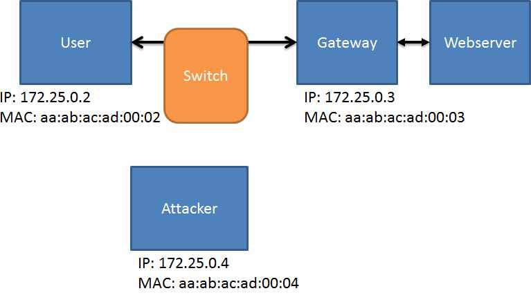
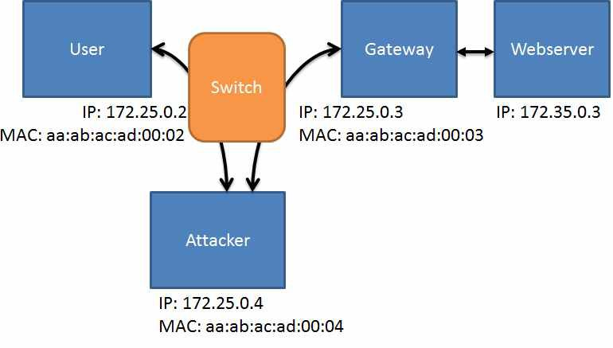

>   ARP Spoofing for Sniffing and Man-in-the-middle Attacks

Overview
========

>   This exercise explores the use of ARP spoofing as a means to sniff local
>   network traffic. Modern Local Area Networks (LANs) use ethernet switches,
>   which prevent passive sniffing of network traffic between other components.
>   This lab assumes you have separately learned about the ARP protocol. ARP
>   spoofing is a technique by which the attacker sends spoofed ARP messages
>   into the LAN, with a goal of causing traffic meant for one IP address to be
>   routed to the attacker’s computer instead. The attacker’s computer then
>   forwards the traffic to the intended destination. This puts the attacker
>   into the middle of the traffic exchange, hence the name ”Man in the Middle”
>   attack.

Lab Environmnet
===============

>   This lab runs in the Labtainer framework, available at
>   [http://my.nps.edu/web/c3o/labtainers.](http://my.nps.edu/web/c3o/labtainers)
>   That site in- cludes links to a pre-built virtual machine that has
>   Labtainers installed, however Labtainers can be run on any Linux host that
>   supports Docker containers.

>   From your labtainer-student directory start the lab using:

>   labtainer arp-spoof

>   Links to this lab manual and to an empty lab report will be displayed. If
>   you create your lab report on a separate system, be sure to copy it back to
>   the specified location on your Linux system.

Network Configuration
=====================

>   This lab includes four networked computers as shown in Figure
>   [1,](#_bookmark0) which illustrates the intended flow of traffic between the
>   user computer and the Webserver via the Gateway.

>   Figure 1: Intended traffic from between User and Webserver

Lab Tasks
=========

>   In this lab, you will use the arpspoof tool to convice the User computer
>   that traffic destined for Gateway should instead be sent to the Attacker
>   computer – and convince the Gateway that traffic destined for the User
>   should be sent to the Attacker computer, as illustrated in
>   [Figure2](#_bookmark1)

>   Figure 2: Man-in-the-middle attack via ARP Spoofing

>   The arpspoof tool is installed on the Attacker computer, as is Wireshark.
>   The Attacker computer is configured to forward IP packets that is receives
>   which are destined for elsewhere. You can confirm this

>   with this command, which should reflect a value of ’1’:

>   sysctl net.ipv4.conf.all.forwarding

Task 1: Sniff the LAN from the Attacker
---------------------------------------

>   Before you engage in ARP spoofing, first look at network traffic as seen by
>   the Attacker. Start Wireshark on the Attacker computer, selecting the ”eth0”
>   interface:

>   wireshark -ki eth0

>   On the User computer, use wget to retrieve a web page from the Webserver:

>   wget \<address of Webserver\>

>   Observe the Wireshark display. Do you see either the web query or the
>   response?

Task 2: Spoof the ARP cache on the User and Gateway Computers
-------------------------------------------------------------

>   Use the arpspoof tool on the Attacker computer to perform your ARP spoofing.
>   Note you must target both the User and Gateway computers. It is easiest to
>   start the arpspoof program in two different virtual terminals connected to
>   the attacker (you may have wondered why you were given three Attacker
>   terminals).

>   sudo arpspoof -t \<User IP\> \<gateway IP\> sudo arpspoof -t \<gateway IP\>
>   \<User IP\>

>   After your ARP spoofing has commenced you should see your spoofed ARP
>   traffic in Wireshark. Now return to the User computer and refetch the web
>   page using wget command. You should see TCP traffic in your Wireshark
>   display. In Wireshark, stop the capture, (red button), and use ”File / Save”
>   to save the traffic into a file named sniff.pcapng in your HOME directory,
>   (/home/ubuntu).

Submission
==========

>   After finishing the lab, go to the terminal on your Linux system that was
>   used to start the lab and type:

>   stoplab arp-spoof

>   When you stop the lab, the system will display a path to the zipped lab
>   results on your Linux system. Provide that file to your instructor, e.g.,
>   via the Sakai site.
