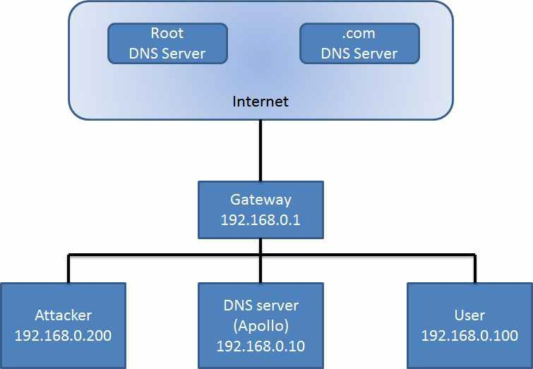

>   Local DNS Attack Lab

Lab Overview
============

DNS [[1]](#_bookmark4) (Domain Name System) is the Internet’s phone book; it
translates hostnames to IP addresses (or IP addresses to hostnames). This
translation is through DNS resolution, which happens behind the scene. DNS
Pharming [[4]](#_bookmark7) attacks manipulate this resolution process in
various ways, with an intent to misdirect users to alternative destinations,
which are often malicious. The objective of this lab is to understand how such
attacks work. Students will first set up and configure a DNS server
[[2],](#_bookmark5) and then they will try various DNS Pharming attacks on the
target that is also within the lab environment.

The difficulties of attacking local victims versus remote DNS servers are quite
different. Therefore, we have developed two labs, one focusing on local DNS
attacks, and the other on remote DNS attack. This lab focuses on local attacks.

Lab Environment
===============

This lab runs in the Labtainer framework, available at
[http://my.nps.edu/web/c3o/labtainers.](http://my.nps.edu/web/c3o/labtainers)
That site in- cludes links to a pre-built virtual machine that has Labtainers
installed, however Labtainers can be run on any Linux host that supports Docker
containers.

 From your labtainer-student directory start the lab using:
```
>   labtainer local-dns
```

Links to this lab manual and to an empty lab report will be displayed. If you
create your lab report on a separate system, be sure to copy it back to the
specified location on your Linux system.

Network Configuration
=====================

The network configuration is illustrated in Figure [1.](#_bookmark0)



>   Figure 1: The Lab Environment Setup

As you can see from Figure [1,](#_bookmark0) we set up the DNS server, the user
machine and the attacker machine in the same LAN. We assume that the user
machine’s IP address is 192.168.0.100, the DNS Server’s IP is 192.168.0.10 and
the attacker machine’s IP is 192.168.0.200. Each of these systems reach the
Internet via a gatway with IP of 192.168.0.1

**Note for Instructors:** For this lab, a lab session is desirable, especially
if students are not familiar with the tools and the environments. If an
instructor plans to hold a lab session (by himself/herself or by a TA), it is
suggested the following to be covered in the lab session [1](#_bookmark1):

1.  The use of the Labtainers.

2.  The use of Wireshark, arpspoof, and Netwox tools.

3.  Configuring the DNS server.

Review the DNS server Configuration
-----------------------------------

The tt BIND 9 server program is installed on the Apollo DNS server
[[3].](#_bookmark6) The DNS server reads a configura- tion file named
/etc/bind/named.conf when it starts. This configuration file includes an option
file, which is called /etc/bind/named.conf.options. Please review that file and
note this entry:

- We assume that the instructor has already covered the concepts of the attacks in the lecture, so we do not include them in the lab session.

```
options {
   dump-file "/var/cache/bind/dump.db";
};
```

- This instructs the DNS server to dump its cache into a file named:
```
/var/cache/bind/dump.db
```

- Whenever you run the command:

```
% sudo rndc dumpdb -cache // Dump the cache to dump.db
```

You may delete the cache using:

```
% sudo rndc flush // Flush the DNS cache
```

- If a change is made to a configuration file, the DNS server must be restarted:

```
% sudo /etc/init.d/bind9 restart
```

 **Create zones.** Assume that we own a domain: example.com, which means that we are responsible for providing the definitive answer regarding example.com. We direct our DNS server to provide naming for the example.com domain by defing a *zone* in a file named example.conf in /etc/bind, and then importing that file into the named.conf confguration via an entry in the /etc/bind/named.conf.local file. It should be noted that the example.com domain name is reserved for use in documentation, and is not owned by anybody, so it is safe to use it. Our zone definition from the example.conf file is below:
 
```
zone "example.com" {

type master;

   file "/var/cache/bind/example.com.db";

   };

   zone "0.168.192.in-addr.arpa" { type master;

   file "/var/cache/bind/192.168.0";

   };
```

Notice how the zone definition refers to the example.com.db file, which defines the DNS resolution for exmple.com and is is referred to as a *zone file*. This file is found in /var/cache/bind directory. Please refer to RFC 1035 for details of zone file definitions. Our example.com.db definition is repeated below:

```
   $TTL 3D

   @ IN SOA ns.example.com. admin.example.com. ( 2008111001 ;serial, today’s
   date + today’s serial number 8H ;refresh, seconds

   2H ;retry, seconds

   4W ;expire, seconds
   1D) ;minimum, seconds

| @   | IN | NS | ns.example.com. ;Address of name server                              |
|------|----|----|----------------------------------------------------------------------|
| @   | IN | MX | 10 mail.example.com. ;Primary Mail Exchanger                         |
| www  | IN | A  | 192.168.0.101 ;Address of [www.example.com](http://www.example.com/) |
| mail | IN | A  | 192.168.0.102 ;Address of mail.example.com                           |
| ns   | IN | A  | 192.168.0.10 ;Address of ns.example.com                              |

*.example.com. IN A 192.168.0.100 ;Address for other URL in

   ;example.com. domain
```

   The symbol ‘\@’ is a special notation meaning the origin from the
   named.conf. Therefore, ‘\@’ here stands for example.com. ‘IN’ means
   Internet. ‘SOA’ is short for Start Of Authority. This zone file contains 7
   resource records (RRs): a SOA (Start Of Authority) RR, a NS (Name Server)
   RR, a MX (Mail eXchanger) RR, and 4 A (host Address) RRs.

   We also need to setup the DNS reverse lookup file. The directory
   /var/cache/bind/, includes a reverse DNS lookup file called 192.168.0 for
   the example.com domain:

```
    $TTL 3D

    @ IN SOA ns.example.com. admin.example.com. ( 2008111001

   8H

   2H

   4W

  1D)

| @  | IN | NS  | ns.example.com.                             |
|-----|----|-----|---------------------------------------------|
| 101 | IN | PTR | [www.example.com.](http://www.example.com/) |
| 102 | IN | PTR | mail.example.com.                           |
| 10  | IN | PTR | ns.example.com.                             |
```

Revview the User Machine Configuration
--------------------------------------

   On the user machine 192.168.0.100, we need to let the machine 192.168.0.10
   be the default DNS server. We achieved this by setting the DNS setting file
   /etc/resolv.conf of the user machine:

   nameserver 192.168.0.10 \# the ip of the DNS server

Review the Attacker Machine Configuration
-----------------------------------------

   The attacher machine includes Wireshark, Netwox and arpspoof untilities.

Expected Output
---------------

   After you have reviewed the lab environment, test the configuration by
   issuing the following command on the user machine:

```
   % dig [www.example.com](http://www.example.com/)

   You should be able to see something like this:

   <<>> DiG 9.5.0b2 <<>> [www.example.com](http://www.example.com/)

   ;; global options: printcmd

   ;; Got answer:

   ;; ->>HEADER<<- opcode: QUERY, status: NOERROR, id: 27136

;; flags: qr aa rd ra; QUERY: 1, ANSWER: 1, AUTHORITY: 1, ADDITIONAL: 1

;; QUESTION SECTION:

[;www.example.com.](http://www.example.com/) IN A

;; ANSWER SECTION:

[www.example.com.](http://www.example.com/) 259200 IN A 192.168.0.101

;; AUTHORITY SECTION:

example.com. 259200 IN NS ns.example.com.

;; ADDITIONAL SECTION:

ns.example.com. 259200 IN A 192.168.0.10

;; Query time: 80 msec

;; SERVER: 192.168.0.10\#53(192.168.0.10)

;; WHEN: Tue Nov 11 15:26:32 2008

;; MSG SIZE rcvd: 82

```
Note: the ANSWER SECTION contains the DNS mapping. Notice that the IP address of [www.example.com](http://www.example.com/) is now 192.169.0.101, which is what
we have set up in the DNS server. For a simple and clear answer, we can use nslookup instead. To do a DNS reverse lookup, issue dig -x N.N.N.N.

Lab Tasks
=========

The main objective of Pharming attacks on a user is to redirect the user to another machine *B* when the user tries to get to machine *A* using *A*’s host
name. For example, when the user tries to access the online banking, such as [www.chase.com,](http://www.chase.com/) if the adversaries can redirect the user
to a malicious web site that looks very much like the main web site of [www.chase.com,](http://www.chase.com/) the user might be fooled and give away
password of his/her online banking account.

When a user types in [www.chase.com](http://www.chase.com/) in his browsers, the user’s machine will issue a DNS query to find out the IP address of this web
site. The attacker’s goal is to fool the user’s machine with a faked DNS reply, which resolves [www.chase.com](http://www.chase.com/) to a malicious IP address.
There are several ways to achieve such an attack. In the first task, we will use [www.example.com](http://www.example.com/) as the web site that the user wants
to access, instead of using the real web site name www.chase.com; the example.com domain name is reserved for use in documentation, and is not owned
by anybody.

Task 1: Attackers have already compromised the victim’s machine
---------------------------------------------------------------

**Modifying HOSTS file.** The host name and IP address pairs in the HOSTS file (/etc/hosts) are used for local lookup; they take the preference over remote DNS
lookups. For example, if there is a following entry in the HOSTS file in the user’s computer, the [www.example.com](http://www.example.com/) will be resolved
as 1.2.3.4 in user’s computer without asking any DNS server:

1.2.3.4 [www.example.com](http://www.example.com/)

**Attacks.** If attackers have compromised a user’s machine, they can modify the HOSTS file to redirect the user to a malicious site whenever the user tries to
access [www.example.com.](http://www.example.com/) Assume that you have already compromised a machine, please try this technique to redirect
[www.example.com](http://www.example.com/) to any IP address that you choose.

- Note: /etc/hosts is ignored by the nslookup command, but will take effect on ping command and web browser etc.

After modifing the /etc/hosts file to test this simple attack, restore it to its original content, e.g., remove any ”example.com” entries.

Task 2: Directly Spoof Response to User
---------------------------------------

In this attack, the victim’s machine has not been compromised, so attackers cannot directly change the DNS query process on the victim’s machine.
   However, if attackers are on the same local area network as the victim, they can still achieve a great damage. Showed as Figure [2.](#_bookmark2)

When a user types the name of a web site (a host name, such as www.example.com) in a web browser, the user’s computer will issue a DNS request to the DNS server
to resolve the IP address of the host name. After hearing this DNS request, the attackers can spoof a fake DNS response [[6].](#_bookmark9) The fake DNS
response will be accepted by the user’s computer if it meets the following criteria:

1.  The source IP address must match the IP address of the DNS server.

2.  The destination IP address must match the IP address of the user’s machine.

3.  The source port number (UDP port) must match the port number that the DNS
    request was sent to (usually port 53).

4.  The destination port number must match the port number that the DNS request
    was sent from.

5.  The UDP checksum must be correctly calculated.

6.  The transaction ID must match the transaction ID in the DNS request.

7.  The domain name in the question section of the reply must match the domain
    name in the question section of the request.

8.  The domain name in the answer section must match the domain name in the
    question section of the DNS request.

9.  The User’s computer must receive the attacker’s DNS reply before it receives
    the legitimate DNS response.

To satisfy the criteria 1 to 8, the attackers can sniff the DNS request message sent by the victim. An ARP spoofing attack, such as conducted in the arp-spoof lab, can be used by the attacker to sniff traffic between the user and the DNS server. Once the attackers can sniff that local traffic, they can then create a fake DNS response, and send back to the victim, before thereal DNS server does. Netwox tool 105 provide a utility to conduct such sniffing and responding.

_ Tip: in the Netwox/Netwag tool 105, you can use the “filter” field to indicate the IP address of your target. For example, in the scenario showing below, you can use "src host 192.168.0.100".


>   Figure 2: Directly Spoof response to user flow

Attempt this attack and use Wireshark on the attacker to observe the traffic. Note that the legitemate DNS reply may arrive at the user’s computer prior to
the bogus one generated by Netwox. This will cause your attack to fail. Think about stratgies an attacker may employ to slow down responses from the DNS
server.

To complete this task, you are not required to succeed in the attack, but you are required to save a PCAP file on your attacker home directory named
”spoof.pcapng”. This PCAP file should include your spoofed DNS response.

Task 3: DNS Server Cache Poisoning
----------------------------------

The above attack targets the user’s machine. In order to achieve long-lasting effect, every time the user’s machine sends out a DNS query for
[www.example.com,](http://www.example.com/) the attacker’s machine must send out a spoofed DNS response. This might not be so efficient; there is a much better
way to conduct attacks by targeting the DNS server, instead of the user’s machine.

When a DNS server *Apollo* receives a query, if the host name is not within the *Apollo*’s domain, it will ask other DNS servers to get the host name resolved.
Note that in our lab setup, the domain of our DNS server is example.com; therefore, for the DNS queries of other domains (e.g. www.google.com), the DNS
server *Apollo* will ask other DNS servers. However, before *Apollo* asks other DNS servers, it first

looks for the answer from its own cache; if the answer is there, the DNS server *Apollo* will simply reply with the information from its cache. If the answer is
not in the cache, the DNS server will try to get the answer from other DNS servers. When *Apollo* gets the answer, it will store the answer in the cache,
so next time, there is no need to ask other DNS servers.

Therefore, if attackers can spoof the response from other DNS servers, *Apollo* will keep the spoofed response in its cache [[5]](#_bookmark8) for certain
period of time. Next time, when a user’s machine wants to resolve the same host name, *Apollo* will use the spoofed response in the cache to reply. This way,
attackers only need to spoof once, and the impact will last until the cached information expires. This attack is called *DNS cache poisoning*. The following
diagram (Figure [3)](#_bookmark3) illustrates this attack.


>   Figure 3: DNS cache posioning flow

We can use the same tool (Netwox 105) for this attack. You will also use an ARP spoofing attack, but this time you want to sniff traffic between the Apollo DNS
server and the external DNS, which is reached via the gateway. So set up your ARP spoofing to sniff traffic between that gateway and the Apollo DNS server.
Before attacking, make sure that the DNS Server’s cache is empty. You can flush the cache using the following command:

```
> sudo rndc flush
```

The difference between this attack and the previous attack is that we are spoofing the response to DNS server now, so we set the filter field to ‘src host
192.168.0.10’, which is the IP address of the DNS server. We also use the ttl field (time-to-live) to indicate how long we want the fake answer to stay in the DNS server’s cache. After the DNS server is poisoned, we can stop the Netwox 105. If we set ttl to 600 (seconds), then DNS server will keep giving out the fake answer for the next 10 minutes.

You can tell whether the DNS server is poisoned or not by using the network traffic captured by Wireshark or by dumping the DNS server’s cache. To dump and
view the DNS server’s cache, issue the following command:

```
> sudo rndc dumpdb -cache
> sudo cat /var/cache/bind/dump.db
```

What’s Next
===========

In the DNS cache poisoning attack of this lab, we assume that the attacker and
the DNS server are on the same LAN, i.e., the attacker can observe the DNS query
message via ARP spoofing. When the attacker and the DNS server are not on the
same LAN, the cache poisoning attack becomes much more challenging. If you are
interested in taking on such a challenge, you can try our “Remote DNS Attack
Lab”.

Submission
==========

Students need to submit a detailed lab report to describe what they have done and what they have observed. Report should include evidence to support the
observations. Evidence include packet traces, screendumps, etc. If you edited your lab report on a separate system, copy it back to the Linux system at the
location identified when you started the lab, and do this before running the stoplab command. After finishing the lab, go to the terminal on your Linux
system that was used to start the lab and type:

```
>   stoplab local-dns


References
==========

1.  RFC 1035 Domain Names - Implementation and Specification :
    <http://www.rfc-base.org/rfc-1035.html>

2.  DNS HOWTO : <http://www.tldp.org/HOWTO/DNS-HOWTO.html>

3.  BIND 9 Administrator ReferenceManual :
    <http://www.bind9.net/manual/bind/9.3.2/Bv9ARM.ch01.html>

4.  Pharming Guide : <http://www.technicalinfo.net/papers/Pharming.html>

5.  DNS Cache Poisoning: <http://www.secureworks.com/resources/articles/other>
    articles/dns-cache- poisoning/

6.  DNS Client Spoof: <http://evan.stasis.org/odds/dns-client> spoofing.txt
