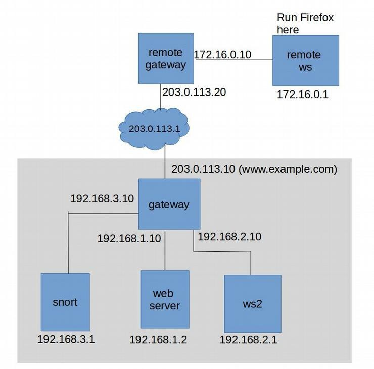

Using Snort
=================================

Overview
========

This exercise introduces the use of the snort system to provide intrusion detection. Students will configure simple snort rules and experiment with a network intrusion detection system, (IDS).

Lab Environment
===============

Once you have logged into your range account and accessed your Labtainer-VM, open a terminal window.

Navigate to the “labtainer-student” directory and start the lab using the
command:

~~~~~~~~~~~~~~~~~~~~~~~~~~~~~~~~~~~~~~~~~~~~~~~~~~~~~~~~~~~~~~~~~~~~~~~~~~~~~~~~
>   labtainer snort
~~~~~~~~~~~~~~~~~~~~~~~~~~~~~~~~~~~~~~~~~~~~~~~~~~~~~~~~~~~~~~~~~~~~~~~~~~~~~~~~

-   Links to this lab manual will be displayed if you wish to view the prompt from within your VM

Network Configuration
=====
This lab includes several networked computers as shown in Figure 1. When the lab starts, you will get (3) virtual terminals, each houses (2) container/components. 

**Terminal 1) 

- The external side of the gateway is with our external address, i.e., 203.0.113.10. and routes web traffic (ports 80 and 443) to the internal gatway container.

- The remote ws component includes the Firefox browser, and is configured with local resolution to reach the www.example.com website via the external IP: 203.0.113.10. The internal workstation (ws2) also includes Firefox and an entry in /etc/hosts for www.example.com. Both workstations also include the nmap utility. "Hank" is our external adversary.


**Terminal 2) 

- The internal side of the gateway is configured with NAT to translate sources addresses of traffic from internal IP addresses, e.g., 192.168.2.1, to our external address, i.e., 203.0.113.10. The iptables in the gateway also routes web traffic (ports 80 and 443) to the web server component by translating the externally visible destination address to the internal web server address. The gateway is configured to mirror traffic that enters the gateway via either the 203.0.113.10 link, or the link to the web server. This mirrored traffic is routed to the snort container. This mirroring allows the snort IDS to reconstruct TCP sessions between the web server and external addresses and monitor traffic.

- The web server runs Apache and is configured to support SSL for web pages in the www.example.com domain. 

**Terminal 3)

- The snort container includes the Snort IDS utility and is assigned to "Tom" in Security. It also includes Wireshark to help you observe traffic being mirrored to the snort container.

- The ws 2 is an internal workstaion used by a company employee (Mary).



Lab Tasks
=====

Starting and stopping snort
=====
The Snort utility is installed on the snort container. The home directory includes a start snort.sh script that will start the utility in Network Intrustion Dection Mode, and display alerts to the console. For this lab, you are required to start snort with:
```
./start_snort.sh
```
When it comes time to stop snort, e.g., to add rules, simply use CTL-C.
 
Pre-configured Snort rules
=====

The Snort utility includes a set of pre-configured rules that create alerts for known suspicious network activity. The configuration on the snort component is largely as it exists after initial installation of the snort utility. To see an example of some of the preconfigured rules, perform an nmap scan of www.example.com from the remote ws container:

```
sudo nmap www.example.com
```

*Note the alerts displayed at the snort console. The rules that generate these alerts can be seen, along with all rules, in /etc/snort/rules/

Write a simple (bad) rule
=====

Custom rules are typically added to the file at /etc/snort/rules/local.rules.

- Stop snort and add a rule that generates an alert for each packet within a TCP stream. For example:
```
alert tcp any any -> any any (msg:"TCP detected"; sid:00002;)
```
**That rule can be read as: “Generate an alert whenever a TCP packet from any address on any port is sent to any address on any port, and include the message tagged as TCP detected:, and give the rule an identifier of 00002.” 

- Restart snort. Test this rule by starting Firefox on the remote ws:
```
firefox www.example.com
```
As you can see, the rule you wrote will overwhelm you with useless information because it is alerting to ALL the TCP traffic being produced by the remote ws's firefox connection to the website. 

- Stop snort and delete the rule.

Custom rule for CONFIDENTIAL traffic
=====

**AS THE ATTACKER- HANK**
- On the remote ws, open a firefox browser and ensure you are connected to http://www.example.com. 

- An attacker (at the remote ws) has learned about an unpublished webpage that exists on the website. In particular, they have learned that there is a confidential business plan at http://www.example.com/plan.html. MAKE SURE YOU ARE USING HTTP, not HTTPS.  View the plan. 

**AS THE DEFENDER- TOM**
- Now lets switch seats back into the defenders' role. Add a rule to your local.rules file on snort that will generate an alert whenever the text ”CONFIDENTIAL” is sent out to the internet. Reference the snort manual https://www.snort.org/ downloads/snortplus/snort_manual.pdf or existing rules to understand how to qualify alerts based on content. Be sure to include the word ”CONFIDENTIAL” in the alert message, and give the rule its own unique sid. 

- After adding the rule, restart snort.

**TEST YOUR RULE AS THE ATTACKER- HANK**

- On the firefox browser at the remote ws, clear your history (Menu / Preferences Security & Privacy), and then refresh the plan.html page. You should see an alert at the snort console.

Effects of encryption
=====

Back at the Firefox browser, again clear the browser history. Now alter the URL to make use of the web server SSL function. Change the url to https://www.example.com/plan.html. Do you see a new snort alert? Why?

One solution to this problem is to use a reverse proxy in front of the web server. This reverse proxy would handle the incoming web traffic and manage the SSL connections. The web server would then receive only clear-text HTTP traffic, and outgoing traffic from the web server could then be mirrored to the IDS. We will not pursue that solution in this lab.
 
Watching internal traffic
=====


**TEST YOUR RULES AS THE EMPLOYEE- MARY**

- Go to the ws2 component and run nmap:
```
sudo nmap www.example.com
```
- What do you see on the snort component? Does it include the ICMP PING NMAP alert that you saw when the remote workstation ran nmap? Why not?

- Go to the gateway component and edit the /etc/rc.local script so that traffic from Mary’s work- station is mirrored to the snort component. You can do this by adding this line to the section of that file that defines the packet mirroring:
```
iptables -t mangle -A PREROUTING -i $lan2 -j TEE --gateway 192.168.3.1
```
- Then run the script to replace the iptables rules with your new rules:
```
sudo /etc/rc.local
```
- Now restart snort and again run nmap from the ws2 computer.

Distinguishing traffic by address
=====

- Start Firefox on mary’s ws2 computer to view the confidential business plan:
```
firefox www.example.com/plan.html
```
Then observe the snort console. This will not do! The keen minds at the startup need to view their confidential business plan without IDS alerts firing off. But they do want to monitor internal computers for suspicious traffic, e.g., nmap scans. In this task, you will adjust your snort rule so that the CONFIDENTIAL alert only fires when the plan is accessed by addresses outside of the site.

- If you review rules found in the /etc/snort/rules directory, you will see that rules have the general form of:
```
alert <protocol> <source_addr> <src_port> -> \
<dest_addr> <dest_port> <rule options in parens>
```
- The snort rules include two address fields: source addr and dest addr. These addresses are used to check the source from which the packet originated and the destination of the packet. The address may be a single IP address or a network address. You likely have used the any keyword to apply a rule on all addresses. For network addresses, the address is followed by a slash character and number of bits in the netmask. For example, a network address of 192.168.2.0/24 represents C class network 192.168.2.0 with 24 bits in the network mask.

*Note that as a result of our use of NAT, all traffic from the web server destined for an external address will have a destination address of the gateway, (i.e., 192.168.1.10), while web traffic destined for internal users will have destination addresses that match the internal user.

- For this task, you must set your snort rules and traffic mirroring such that:
1.	External access to the business plan generates an alert;
2.	Internal access to the business plan does not generate an alert;
3.	External or internal use of nmap will generate an ICMP NMAP PING alert.

Your must test each of these criteria during a single snort session, i.e., if you change a snort rule, or port mirroring, you must restart your tests.
 
Submission
=====
After finishing the lab, go to the terminal on your Linux system that was used to start the lab and type:

```
stoplab snort
```

