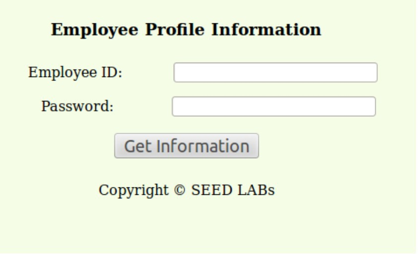
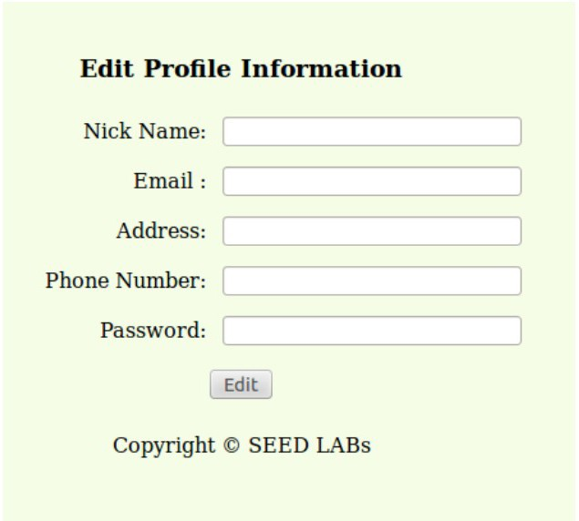

SQL Injection Attack Lab
=================================

Overview
========


SQL injection is a code injection technique that exploits the
vulnerabilities in the interface between web applications and database
servers. The vulnerability is present when user’s inputs are not correctly
checked within the web applications before being sent to the back-end
database servers.

Many web applications take inputs from users, and then use these inputs to
construct SQL queries, so the web applications can get information from the
database. Web applications also use SQL queries to store information in the
database. These are common practices in the development of web applications.
When SQL queries are not carefully constructed, SQL injection
vulnerabilities can occur. The SQL injection attack is one of the most
common attacks on web applications.

In this lab, we have created a web application that is vulnerable to the SQL
injection attack. Our web application includes the common mistakes made by
many web developers. Students’ goal is to find ways to exploit the SQL
injection vulnerabilities, demonstrate the damage that can be achieved by
the attack, and master the techniques that can help defend against such type
of attacks.

Lab Environment
===============

Once you have logged into your range account and accessed your Labtainer-VM,
open a terminal window.

Navigate to the “labtainer-student” directory and start the lab using the
command:

~~~~~~~~~~~~~~~~~~~~~~~~~~~~~~~~~~~~~~~~~~~~~~~~~~~~~~~~~~~~~~~~~~~~~~~~~~~~~~~~
>   labtainer sql-inject
~~~~~~~~~~~~~~~~~~~~~~~~~~~~~~~~~~~~~~~~~~~~~~~~~~~~~~~~~~~~~~~~~~~~~~~~~~~~~~~~

-   Links to this lab manual will be displayed if you wish to view the prompt
    from within your VM
-   A useful online SQL tutorial can be found at [http://www.w3schools.com/sql/.](http://www.w3schools.com/sql/)

Lab Tasks
=========

- We have a web application hosted it at [www.SEEDLabSQLInjection.com](http://www.SEEDLabSQLInjection.com/) 

This web application is a simple employee management application. Employees can view and update their personal information in the database through this web application. There are mainly two roles in this web application:

- Administrator is a privilege role and can manage each individual employees’ profile information
- Employee is a normal role and can view or update his/her own profile information. 

Task 1: MySQL Console
=========

The objective of this task is to get familiar with SQL commands by playing with the provided database. We have created a database called Users, which
contains a table called credential. The table stores the personal information (e.g. eid, password, salary, ssn, etc.) of every employee for the organization.

The administrator is allowed to change the profile information of all employees, but each employee can only change his/her own information. In this task, you
need to play with the database to get familiar with SQL queries.

MySQL is an open-source relational database management system. We have already setup MySQL in the “server” component. 
- The user name is "root"
- The password is "seedubuntu"

- Using the "student@web-server" container terminal, log into a MySQL console on the server.

```
$ mysql -u root -pseedubuntu
```
After login, we will be loading an existing database. Load the "Users" database using the following command:
```
mysql> use Users;
```
To show what tables are in the Users database, use the following command:
```
mysql> show tables;
```

To see how the "credential" table is constructed, you can use the following command:
```
mysql> describe credential;
```
To see all of the data entries for the "credential" table is constructed, you can use the following command:
```
mysql> SELECT * FROM credential;
```

Task 2: SQL Injection Attack on SELECT Statement
=========

SQL injection is basically a technique through which attackers can execute their own malicious SQL statements generally referred as malicious payload.
Through the malicious SQL statements, attackers can steal information from the victim database; even worse, they may be able to make changes to the database. The employee management web application you will be be working with here has SQL injection vulnerabilities which mimic the mistakes frequently made by developers.

The browser starts at the entrance page of our web application at http://www.SEEDLabSQLInjection.com, where you will be asked to provide Employee ID and Password to log in. The login page is shown in Figure 1. The authentication is based on Employee ID and Password, so only employees who know their IDs and passwords are allowed to view/update their profile information. Your job, as an attacker, is to log into the application without knowing any employee’s credential.



   **Figure 1: The Login Page**

To help you started with this task, we explain how authentication is implemented in our web application. The PHP code unsafe_credential.php, located in the /var/www/seedlabsqlinjection.com/public_html directory, is used to conduct user authentication. The following code snippet show how users are authenticated.
```
\$conn = getDB();

$sql = "SELECT id, name, eid, salary, birth, ssn, phonenumber, address, email, nickname, Password
    FROM credential
   WHERE eid= ’$input_eid’ and password=’$input_pwd’";
$result = $conn->query($sql))
```
The above SQL statement selects personal employee information such as id, name, salary, ssn etc from the credential table. The variables input eid and input pwd hold the strings typed by users in the login page. 

- The following is pseudo code provides an idea of how the results of SQL query are handled.
```
if(name==’admin’){
    return All employees information.
} else if(name!=NULL){
   return employee information.
} else {
   authentication fails.
   }
```
Basically, the program checks whether any record matches with the employee ID and password; if there is a match, the user is successfully authenticated, and is given the corresponding employee information. If there is no match, the authentication fails.

Task 2.1: SQL Injection Attack from webpage
=========
Your task is to log into the web application as the administrator from the login page, so you can see the information of all the employees. We assume you do know the administrator’s account name is "Admin", but you do not know the ID or the password. You need to decide what to type in the Employee ID and Password fields to succeed in the attack.
    
- Important information: the "#" symbol is MySQL's version of the line comment delimiter. In standard SQL, the line comment delimiter is --.

```
-- This is a standard SQL comment.
# This is a MySQL comment.
```

So in the context of SQL injection, you (the attacker) know the site is using MySQL. Use the "#" to abruptly terminate a SQL statement, causing MySQL to ignore whatever is behind the # and execute only what comes before it. Here's an example:

```
Input:

Username: fake' OR Name='Alice';#
Password: anything or nothing
```
Resultant SQL:

```
SELECT * FROM credential WHERE eid = 'fake' OR Alice#' AND password = 'anything or nothing'
```

Which is executed as this, which returns every row:
```
SELECT * FROM credentials WHERE eid = 'fake' OR Name = 'Alice'
```


Task 2.2: SQL Injection Attack from command line
=========

Your task is to repeat Task 2.1, but you need to do it without using the webpage. Within the client virtual terminal, you can use command line tools, such as curl, which can send HTTP requests. One thing that is worth mentioning is that if you want to include multiple parameters in HTTP requests, you need to put the URL and the parameters between a pair of single quotes; otherwise, the special characters used to separate parameters (such as &) will be interpreted by the shell program, changing the meaning of the command. 

Use the following to send an HTTP GET request to the web application, with two parameters for Alice (EID and Password):
```
curl ’www.SeedLabSQLInjection.com/unsafe_credential.php?EID=10000&Password=seedalice’
```

Observe the results (in the terminal you should see Alice's information as a response.

- Now you will need to use the same logic as you did in task 2.1 and construct a curl statement to dump all employee information. 


Note: You will need to include special characters and must encode them per HTTP, or they can change the meaning of your requests. 

```
= is %3D
; is %3B
' is  %27 
a space is  %20
```


Task 3: SQL Injection Attack on UPDATE Statement
=========

If a SQL injection vulnerability happens to an UPDATE statement, the damage will be more severe, because attackers can use the vulnerability to modify
databases. In our Employee Management application, there is an Edit Profile page (Figure 2) that allows employees to update their profile information,
including nickname, email, address, phone number, and password. To go to this page, employees need to login first. Login as Alice with the EID of '10000' and the password of 'seedalice' to check out this page (located at seedlabsqlinjection.com/edit.php)

When employees update their information through the Edit Profile page, an SQL UPDATE query will be executed. The PHP code implemented in the unsafe_edit.php file is used to update employee’s profile information. The following code snippet is how this "unsafe_edit/php' page allows an employee to edit their profile.

```
$conn = getDB();
$sql = "UPDATE credential SET nickname=’$nickname’, email=’$email’,
   address=’$address’, phonenumber=’$phonenumber’, Password=’$pwd’
   WHERE id= ’$input_id’ ";
$conn->query($sql))
```



Task 3.1: SQL Injection Attack on UPDATE Statement — modify salary
=====

As shown in the Edit Profile page, employees can only update their nicknames, emails, addresses, phone numbers, and passwords; they are not authorized to change their salaries. Only the administrator is allowed to make changes to salaries. You are a malicious employee (say Alice); your goal in this task is to increase your own salary via this Edit Profile page. We assume that you know that salaries are stored in a column called 'salary'.


To make sure your injection string does not contain any syntax error, you can test your injection string on MySQL console before launching the real
attack on our web application.


Submission
==========

After finishing the lab, go to the terminal on your Linux system that was
used to start the lab and type:
```
>   stoplab sql-inject
```
