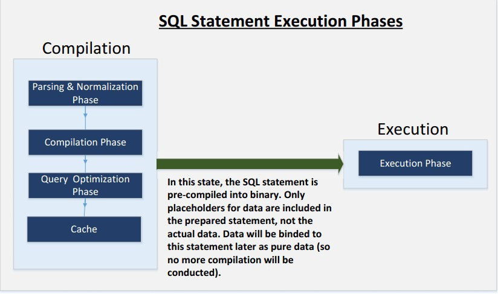

SQL Injection Attack Lab
=================================

Overview
========


SQL injection is a code injection technique that exploits the
vulnerabilities in the interface between web applications and database
servers. The vulnerability is present when user’s inputs are not correctly
checked within the web applications before being sent to the back-end
database servers.

Many web applications take inputs from users, and then use these inputs to
construct SQL queries, so the web applications can get information from the
database. Web applications also use SQL queries to store information in the
database. These are common practices in the development of web applications.
When SQL queries are not carefully constructed, SQL injection
vulnerabilities can occur. The SQL injection attack is one of the most
common attacks on web applications.

In this lab, we have created a web application that is vulnerable to the SQL
injection attack. Our web application includes the common mistakes made by
many web developers. Students’ goal is to find ways to exploit the SQL
injection vulnerabilities, demonstrate the damage that can be achieved by
the attack, and master the techniques that can help defend against such type
of attacks.

Lab Environment
===============

Once you have logged into your range account and accessed your Labtainer-VM,
open a terminal window.

Navigate to the “labtainer-student” directory and start the lab using the
command:

~~~~~~~~~~~~~~~~~~~~~~~~~~~~~~~~~~~~~~~~~~~~~~~~~~~~~~~~~~~~~~~~~~~~~~~~~~~~~~~~
>   labtainer sql-inject
~~~~~~~~~~~~~~~~~~~~~~~~~~~~~~~~~~~~~~~~~~~~~~~~~~~~~~~~~~~~~~~~~~~~~~~~~~~~~~~~

-   Links to this lab manual will be displayed if you wish to view the prompt
    from within your VM
-   A useful online SQL tutorial can be found at [http://www.w3schools.com/sql/.](http://www.w3schools.com/sql/)

Lab Tasks
=========

- We have a web application hosted it at [www.SEEDLabSQLInjection.com](http://www.SEEDLabSQLInjection.com/) 

This web application is a simple employee management application. Employees can view and update their personal information in the database through this web application. There are mainly two roles in this web application:

- Administrator is a privilege role and can manage each individual employees’ profile information
- Employee is a normal role and can view or update his/her own profile information. 

All employee information is described in the following table.

| User  | Emploee ID | Password  | Salary | Birthday | SSN      |
|-------|------------|-----------|--------|----------|----------|
| Admin | 99999      | seedadmin | 400000 | 3/5      | 43254314 |
| Alice | 10000      | seedalice | 30000  | 9/20     | 10211002 |
| Bob99y  | 20000      | seedboby  | 50000  | 4/20     | 10213352 |
| Ryan  | 30000      | seedryan  | 90000  | 4/10     | 32193525 |
| Samy  | 40000      | seedsamy  | 40000  | 1/11     | 32111111 |
| Ted   | 50000      | seedted   | 110000 | 11/3     | 24343244 |

Task 1: MySQL Console
=========

The objective of this task is to get familiar with SQL commands by playing
with the provided database. We have created a database called Users, which
contains a table called credential; the table stores the personal
information (e.g. eid, password, salary, ssn, etc.) of every employee.

Administrator is allowed to change the profile information of all employees,
but each employee can only change his/her own information. In this task, you
need to play with the database to get familiar with SQL queries.

MySQL is an open-source relational database management system. We have
already setup MySQL in the “server” component. 
- The user name is "root"
- The password is "seedubuntu"

- Using the "student@web-server" container terminal, log into a MySQL console on the server.

```
>   \$ mysql -u root -pseedubuntu
```
After login, you can create new database or load an existing one. As we have
already created the Users database for you, you just need to load this
existing database using the following command:
```
>   mysql\> use Users;
```
To show what tables are there in the Users database, you can use the
following command to print out all the tables of the selected database.
```
>   mysql\> show tables;
```

Task 2: SQL Injection Attack on SELECT Statement
=========

SQL injection is basically a technique through which attackers can execute their own malicious SQL statements generally referred as malicious payload.
Through the malicious SQL statements, attackers can steal information from the victim database; even worse, they may be able to make changes to the database. Our employee management web application has SQL injection vulnerabilities, which mimic the mistakes frequently made by developers.

The browser starts at the entrance page of our web application at [www.SEEDLabSQLInjection.com](http://www.SEEDLabSQLInjection.com/), where you will be asked to provide Employee ID and Password to log in. The login page is shown in Figure 1. The authentication is based on Employee ID and Password, so only employees who know their IDs and passwords are allowed to view/update their profile information. Your job, as an attacker, is to log into the application without knowing any employee’s credential.


   **Figure 1: The Login Page**

To help you started with this task, we explain how authentication is implemented in our web application. The PHP code unsafe_credential.php, located in the /var/www/seedlabsqlinjection.com/public_html directory, is used to conduct user authentication. The following code snippet show how users are authenticated.
```
\$conn = getDB();

$sql = "SELECT id, name, eid, salary, birth, ssn, phonenumber, address, email, nickname, Password
    FROM credential
   WHERE eid= ’\$input_eid’ and password=’\$input_pwd’";
$result = \$conn-\>query(\$sql))

// The following is pseudo code 
if(name==’admin’){
    return All employees information.
} else if(name!=NULL){
   return employee information.
} else {
   authentication fails.

   }
```
The above SQL statement selects personal employee information such as id, name, salary, ssn etc from the credential table. The variables input eid and input pwd hold the strings typed by users in the login page. Basically, the program checks whether any record matches with the employee ID and password; if there is a match, the user is successfully authenticated, and is given the corresponding employee information. If there is no match, the authentication fails.

-   **Task 2.1: SQL Injection Attack from webpage**. Your task is to log into the web application as the administrator from the login page, so you can see
    the information of all the employees. We assume that you do know the administrator’s account name which is admin, but you do not know the ID or
    the password. You need to decide what to type in the Employee ID and Password fields to succeed in the attack.

-   **Task 2.2: SQL Injection Attack from command line**. Your task is to repeat Task 2.1, but you need to do it without using the webpage. Within the client
    virtual terminal, you can use command line tools, such as curl, which can send HTTP requests. One thing that is worth mentioning is that if you want
    to include multiple parameters in HTTP requests, you need to put the URL and the parameters between a pair of single quotes; otherwise, the special
    characters used to separate parameters (such as &) will be interpreted by the shell program, changing the meaning of the command. The following
    example shows how to send an HTTP GET request to our web application, with two parameters (SUID and Password) attached:
```
curl
>   [’www.SeedLabSQLInjection.com/index.php?SUID=10000&Password=111’](http://www.SeedLabSQLInjection.com/index.php?SUID=10000&Password=111)
```

If you need to include special characters in the SUID and Password fields, you need to encode them properly, or they can change the meaning of your
requests. If you want to include single quote in those fields, you should use %27 instead; if you want to include white space, you should use %20. In
this task, you do need to handle HTTP encoding while sending requests using curl.

-   **Task 2.3: Append a new SQL statement**. In the above two attacks, we can only steal information from the database; it will be better if we can modify
    the database using the same vulnerability in the login page. An idea is to use the SQL injection attack to turn one SQL statement into two, with the
    second one being the update or delete statement. In SQL, semicolon (;) is used to separate two SQL statements. Please describe how you can use the
    login page to get the server run two SQL statements. Try the attack to delete a record from the database, and describe your observation.

Task 3: SQL Injection Attack on UPDATE Statement
=========

If a SQL injection vulnerability happens to an UPDATE statement, the damage will be more severe, be- cause attackers can use the vulnerability to modify
databases. In our Employee Management application, there is an Edit Profile page (Figure 2) that allows employees to update their profile information,
including nickname, email, address, phone number, and password. To go to this page, employees need to login first.

When employees update their information through the Edit Profile page, the following SQL UPDATE query will be executed. The PHP code implemented in
unsafe_edit.php file is used to update employee’s profile information. The PHP file is located in the /var/www/seedlabsqlinjection.com/public_html
directory.

```
   \$conn = getDB();

   \$sql = "UPDATE credential SET nickname=’\$nickname’, email=’\$email’,

   address=’\$address’, phonenumber=’\$phonenumber’, Password=’\$pwd’

   WHERE id= ’\$input_id’ ";
```

```
   \$conn-\>query(\$sql))
```

>   **Figure 2: Edit Profile**

-   **Task 3.1: SQL Injection Attack on UPDATE Statement — modify salary**. As shown in the Edit Profile page, employees can only update their nicknames,
    emails, addresses, phone numbers, and passwords; they are not authorized to change their salaries. Only administrator is allowed to make changes to
    salaries. If you are a malicious employee (say Alice), your goal in this task is to increase your own salary via this Edit Profile page. We assume that you
>   do know that salaries are stored in a column called salary.

-   **Task 3.2: SQL Injection Attack on UPDATE Statement — modify other people’
    password**. Using the same vulnerability in the above UPDATE statement, malicious employees can also change other people’s data. The goal for this
    task is to modify another employee’s password, and then demonstrate that you can successfully log into the victim’s account using the new password. The
    assumption here is that you already know the name of the employee (e.g. Ryan) on whom you want to attack. One thing worth mentioning here is that
    the database stores the hash value of passwords instead of the plaintext password string. You can again look at the unsafe_edit.php code to see how
    password is being stored. It uses SHA1 hash function to generate the hash value of password.

To make sure your injection string does not contain any syntax error, you can test your injection string on MySQL console before launching the real
attack on our web application.

Task 4: Countermeasure — Prepared Statement
=========

The fundamental problem of the SQL injection vulnerability is the failure to separate code from data. When constructing a SQL statement, the program
(e.g. PHP program) knows which part is data and which part is code. Unfortunately, when the SQL statement is sent to the database, the boundary
has disappeared; the boundaries that the SQL interpreter sees may be different from the original boundaries that was set by the developers. To
solve this problem, it is important to ensure that the view of the boundaries are consistent in the server-side code and in the database. The
most secure way is to use prepared statement.



   **Figure 3: Prepared Statement Workflow**

To understand how prepared statement prevents SQL injection, we need to understand what happens when SQL server receives a query. The high-level
workflow of how queries are executed is shown in 

Figure 3. In the compilation step, queries first go through the parsing and normalization phase, where a query is checked against the syntax and
semantics. The next phase is the compilation phase where keywords (e.g. SELECT, FROM, UPDATE, etc.) are converted into a format understandable to
machines. Basically, in this phase, query is interpreted. In the query optimization phase, the number of different plans are considered to execute
the query, out of which the best optimized plan is chosen. The chosen plan is store in the cache, so whenever the next query comes in, it will be
checked against the content in the cache; if it’s already present in the cache, the parsing, compilation and query optimization phases will be
skipped. The compiled query is then passed to the execution phase where it is actually executed.

Prepared statement comes into the picture after the compilation but before the execution step. A pre- pared statement will go through the compilation
step, and be turned into a pre-compiled query with empty placeholders for data. To run this pre-compiled query, data need to be provided, but these
data will not go through the compilation step; instead, they are plugged directly into the pre-compiled query, and are sent to the execution engine.
Therefore, even if there is SQL code inside the data, without going through the compilation step, the code will be simply treated as part of data,
without any special meaning. This is how prepared statement prevents SQL injection attacks.

Here is an example of how to write a prepared statement in PHP. We use a SELECT statement in the following example. We show how to use prepared
statement to rewrite the code that is vulnerable to SQL injection attacks.

```
   \$conn = getDB();

   \$sql = "SELECT name, local, gender FROM USER_TABLE

   WHERE id = \$id AND password =’\$pwd’ ";

   \$result = \$conn-\>query(\$sql))
```
The above code is vulnerable to SQL injection attacks. It can be rewritten to the following:

```
   \$conn = getDB();

   \$stmt = \$conn-\>prepare("SELECT name, local, gender FROM USER_TABLE

   WHERE id = ? and password = ? ");

   // Bind parameters to the query

   \$stmt-\>bind_param("is", \$id, \$pwd);

   \$stmt-\>execute();

   \$stmt-\>bind_result(\$bind_name, \$bind_local, \$bind_gender);

   \$stmt-\>fetch();
```
Using the prepared statement mechanism, we divide the process of sending a SQL statement to the database into two steps. The first step is to only send
the code part, i.e., a SQL statement without the actual the data. This is the prepare step. As we can see from the above code snippet, the actual data
are replaced by question marks (?). After this step, we then send the data to the database using bind_param(). The database will treat everything sent
in this step only as data, not as code anymore. It binds the data to the corresponding question marks of the prepared statement. In the bind param() method, the first argument "is" indicates the types of the parameters: "i" means that the data in \$id has the integer type, and "s" means that the data in \$pwd has the string type.

For this task, please use the prepared statement mechanism to fix the SQL injection vulnerabilities exploited by you in the previous tasks. Then,
check whether you can still exploit the vulnerability or not.

Submission
==========

After finishing the lab, go to the terminal on your Linux system that was
used to start the lab and type:
```
>   stoplab sql-inject
```
