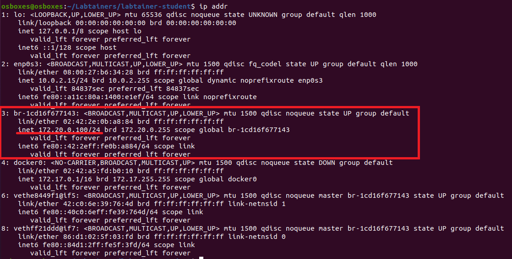

Telnet Lab
=================================

Overview
========

This labtainer exercise illustrates the use of a telnet client to access
resources on a server. It is a simple lab intended to illustrate basic client
server networking and the transmission of plaintext passwords over a network by
telnet.

Lab Environment
===============

Once you have logged into your range account and accessed your Labtainer-VM,
use the "labtainer-student" shortcut to open a terminal window.

Navigate to the “labtainer-student” directory and start the lab using the
command:

~~~~~~~~~~~~~~~~~~~~~~~~~~~~~~~~~~~~~~~~~~~~~~~~~~~~~~~~~~~~~~~~~~~~~~~~~~~~~~~~
>   labtainer telnetlab
~~~~~~~~~~~~~~~~~~~~~~~~~~~~~~~~~~~~~~~~~~~~~~~~~~~~~~~~~~~~~~~~~~~~~~~~~~~~~~~~

-   Links to this lab manual will be displayed if you wish to view the prompt
    from within your VM

Tasks
=====

Start sniffing traffic
=====

You should have two additional terminal's open after starting the lab that represent an ubuntu client and server. These hosts reside on docker containers.

*A container is a standard unit of software that packages up code and all its dependencies so the application runs quickly and reliably from one computing environment to another.

From your ubuntu host, you will need to first identify the docker network ID's so you know what adapter to sniff traffic on. From the terminal window that you deployed the lab from, type "ip addr" (not the new terminal windows).  This will return a list of network adapters and information.  Locate the adapter that is on the 172.20.0.0/24 network.  This is the network that the container client and server are connected to. 

The image below shows the adapter and network, however the identifier will most likley me different as it is created dynamically.



From your host's terminal, you will now need to run Wireshark and select the adapter that you identified in the previous step.  Ensure you run Wireshark with administrative priviledges. 

```
sudo wireshark

```

Select the correct adapter and start capturing traffic.

No packets should apear in the Wireshark window until you are interacting between the client and server containers in the next steps.


Determine the server IP address
=====

- In the terminal window with the label "ubuntu@server", type “ip addr” to view the IP address of the server. The
server IP address will follow the “inet” label.

- You may also use the ifconfig command to view this information. This is an older, deprecated command but still supported on popular Linux distrobutions.

Telnet to telnet server and display a file on the server
=====

- You will now be working from the client computer. In the terminal window with the label "ubuntu@client" use the telnet command to access the server using the IP
address you discovered in the previous step:

```
>   telnet <IP ADDRESS>
```

- You will be prompted for a user ID and then a password. Both user ID and password are “ubuntu”.

- Once logged into the server, you will see that your terminal prompt changes from "ubuntu@client" to "ubuntu@server" You can view the files in your current directory using the "ls" command. You will see a file on the server named “filetoview.txt”. 

- Use the "ls" command 

- View the file content by typing:
``
>   cat filetoview.txt
``
- Exit the telnet session on the client via the “exit” command.

View plaintext passwords with Wireshark and TCPdump
=====

- Ensure that Wireshark is open on your ubunutu host and capturing traffic on the docker container adapter that was previously identified. 

- On the client start a telnet session, but when prompted for the password type “mydoghasfleas” (you know this password is incorrect).

- You should see packets populating in the Wireshark windows. 

- In Wireshark, right-click on any of the packets in the stream and go "Follow > TCP Stream". A new window should open with the traffic stream reconstructed from the packets captured.  Take note of the password entry seen in plaintext.

- Now trying viewing this information through TCPDump.  On the ubuntu server, run TCPdump and watch the very end of the hexidecimal output for the data being pushed in each segment.

```
>   sudo tcpdump -i eth0 -X dst 172.20.0.3
```

*As you type each letter of the password, notice that the tcpdump traffic captures them in seperate segments.

Use SSH to protect communications with the server
=====
- Ensure that Wireshark is open on your ubunutu host and restart the packet capture on the docker container adapter that was previously identified. 

- From the client computer, use the SSH command to access the server using its IP address:
```
>   ssh <IP ADDRESS>
```
- The first time you SSH to a server, SSH will warn you that the “authenticity ofthe host… can’t be established”. Type “yes” at the prompt.

- View the file content by typing:
```
>   cat filetoview.txt
```

- In Wireshark, right-click on any of the packets in the stream and go "Follow > TCP Stream". A new window should open with the traffic stream reconstructed from the packets captured.  Take note of the password entry; is the password still seen in plaintext?

Stop the Labtainer
==================

When the lab is completed, or you’d like to stop working for a while, run:
```
>   stoplab telnetlab
```
From the host labtainer working directory. You can always restart the labtainer
and try the lab again if you are unable to complete it. 
